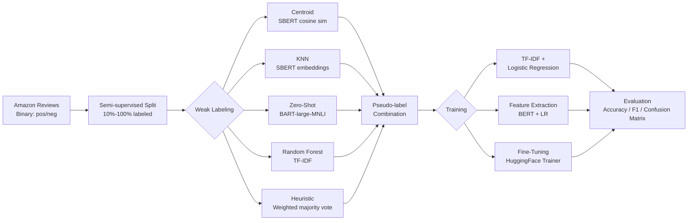

# Sentiment Analysis with Weak Labeling

Semi-supervised sentiment analysis on Amazon product reviews using five weak labeling strategies and three baseline training approaches. The project investigates how pseudo-labels generated from unlabeled data can improve classifier performance when only a fraction of ground-truth labels is available.

## Pipeline Architecture



## Dataset

- **Source**: Amazon product reviews
- **Task**: Binary sentiment classification (positive / negative)
- **Setup**: Semi-supervised -- only a configurable fraction (10%--100%) of labels is treated as "hard" (known); the rest is unlabeled and receives weak labels

## Weak Labeling Strategies

| Strategy | Method | Key Detail |
|---|---|---|
| **Centroid** | Cosine similarity between SBERT embeddings and per-class centroids | Embedding model: `all-MiniLM-L6-v2` |
| **KNN** | K-Nearest Neighbors on SBERT embedding space | Dynamic k based on hard label count |
| **Zero-Shot** | Zero-shot classification via `facebook/bart-large-mnli` | Candidate labels: positive, negative |
| **Random Forest** | RF trained on TF-IDF of hard labels, applied to unlabeled data | Adaptive confidence threshold for balanced class output |
| **Heuristic** | Weighted majority vote of keyword/phrase labeling functions | Weights: keyword LFs 0.5, phrase LF 1.0 |

## Training Approaches

1. **TF-IDF + Logistic Regression** -- Classical bag-of-words baseline
2. **Feature Extraction** -- DistilBERT (`distilbert-base-uncased`) embeddings fed to Logistic Regression
3. **Fine-Tuning** -- End-to-end fine-tuning with HuggingFace `Trainer`

Each approach supports **pseudo-labeling**: hard labels and weak labels are combined with configurable weights (`weight_orig`, `weight_weak`) to form the training set.

## Results

### Baseline Performance (hard labels only, full dataset)

| Approach | Test Accuracy | Test F1 |
|---|---|---|
| TF-IDF + LR | 0.864 | 0.864 |
| Feature Extraction | 0.885 | 0.885 |
| Fine-Tuning | 0.883 | 0.883 |

### Pseudo-label Experiments (weighted)

Best configuration: **Zero-Shot weak labeling** with `weight_weak=1.0` achieves F1 **0.876** at 40% labeled split, consistently outperforming Centroid-based labeling across all split sizes and weight configurations.


### Key Findings

- Zero-Shot weak labels consistently outperform all other strategies
- Higher weak-label weights improve performance when the weak labeler is accurate (Zero-Shot), but can hurt when it is noisy (Centroid)
- Fine-tuning delivers the strongest single-method results (~0.88--0.94 test accuracy)
- Pseudo-labeling is most beneficial at small labeled fractions (10--20%), where additional weak data has the highest marginal value

## Project Structure

```
Sentimentanalyse/
  main.ipynb              # Main analysis notebook
  src/
    weak_label.py         # 5 weak labeling strategies
    baseline.py           # 3 training approaches + pseudo-labeling
    embedding.py          # Embedding generation utilities
    plots.py              # Evaluation visualizations
    utils.py              # Text utilities
  data/                   # Labeled dataset splits
  data_weak_labels/       # Weak-labeled output
  results/                # Per-method evaluation reports
    tfidf/
    feature_extraction/
    fine_tuning/
    my_weighted_reports/  # Pseudo-label experiment results + plots
  outputs/embeddings/     # Cached embeddings (SBERT, DistilBERT)
```

## Setup

```bash
pip install -r requirements.txt
```

### Key Dependencies

- sentence-transformers
- transformers / datasets (HuggingFace)
- scikit-learn
- PyTorch
- NLTK
- matplotlib / seaborn
- pandas / numpy

### Running

```bash
jupyter notebook Sentimentanalyse/main.ipynb
```

